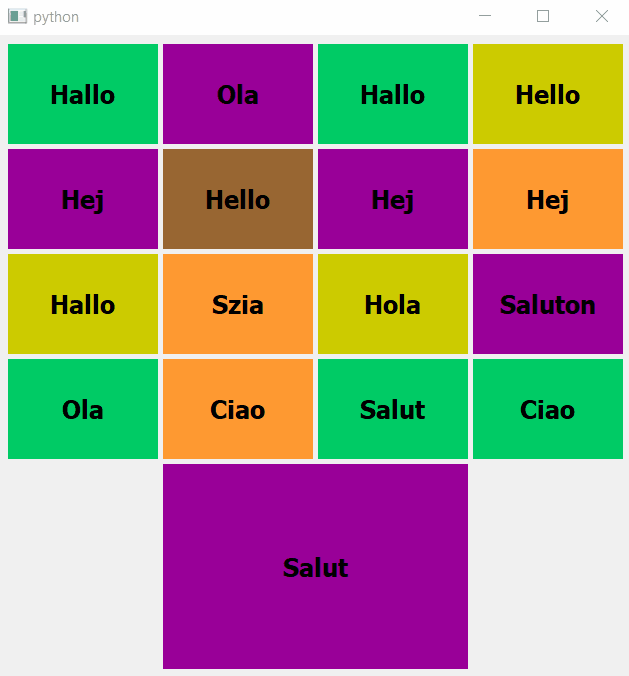

# qt-tile-layout

A tile layout for PyQt



# Quick example

Just launch the ```test.py``` script to have a first look (be sure to have installed PyQt5)

# Create and use a tile layout

First of all, the import statement

```python
from tile_layout import TileLayout
```

Then, let's create a tile layout with 8 rows and 5 columns.  
We also give the vertical and horizontal spawn in pixel

```python
layout = TileLayout(
    row_number=8,
    column_number=5,
    vertical_spawn=100,
    horizontal_span=150,
)
```

We can now add a widget in a specific position: it's the same as the grid layout

```python
layout.addWidget(
    widget=QtWidgets.QLabel('Hello world'),
    from_row=3,
    from_column=2,
    row_span=1,
    column_span=2
)
```

Finally, if you put your layout into a window, you will be able to drag and drop the above widget and resize its  

# Documentation

```TileLayout(int from_row, int from_column, int row_span, int column_span)```

_Constructs a new tile layout_

##### Methods:

- ```acceptDragAndDrop(bool value)```

_Allows or not the drag and drop of tiles in the layout_

- ```acceptResizing(bool value)```

_Allows or not the resizing of tiles in the layout_

- ```addWidget(QWidget widget, int from_row, int from_column, int row_span, int column_span)```

_Adds the given widget to the layout, spanning multiple rows/columns. The tile will start at fromRow, fromColumn spanning rowSpan rows and columnSpan columns_

- ```columnCount() -> int```

_Returns the number of column in the layout_

- ```columnMinimumwidth() -> int```

_Return the tile width (the name is not very obvious but it is consistent with grid layout)_

- ```horizontalSpacing() -> int```

_Returns the horizontal spacing between two tiles_ 

- ```removeWidget(QWidget widget)```

_Removes the given widget from the layout_

- ```rowCount() -> int```

_Returns the number of row in the layout_

- ```rowMinimumHeight() -> int```

_Return the tile height (the name is not very obvious but it is consistent with grid layout)_

- ```setCursorGrab(QtCore.Qt.CursorShape value)```

_Changes the cursor shape when it is possible to drag a tile_

- ```setCursorIdle(QtCore.Qt.CursorShape value)```

_Changes the cursor shape when it is over a tile_

- ```setCursorResizeHorizontal(QtCore.Qt.CursorShape value)```

_Changes the cursor shape when it is possible to resize a tile horizontally_

- ```setCursorResizeVertical(QtCore.Qt.CursorShape value)```

_Changes the cursor shape when it is possible to resize a tile vertically_

- ```setHorizontalSpacing(int spacing)```

_Changes the horizontal spacing between two tiles_

- ```setHorizontalSpan(int span)```

_Sets the horizontal span between two tiles_ 

- ```setVerticalSpacing(int spacing)```

_Changes the vertical spacing between two tiles_

- ```setVerticalSpan(int span)```

_Sets the vertical span between two tiles_ 

- ```tileRect(int row, int column) -> QRect```

_Returns the geometry of the tile at (row, column)_ 

- ```verticalSpacing() -> int```

_Returns the vertical spacing between two tiles_ 

# Last word

Feel free to use this layout and to notice me if there are some bugs or useful features to add